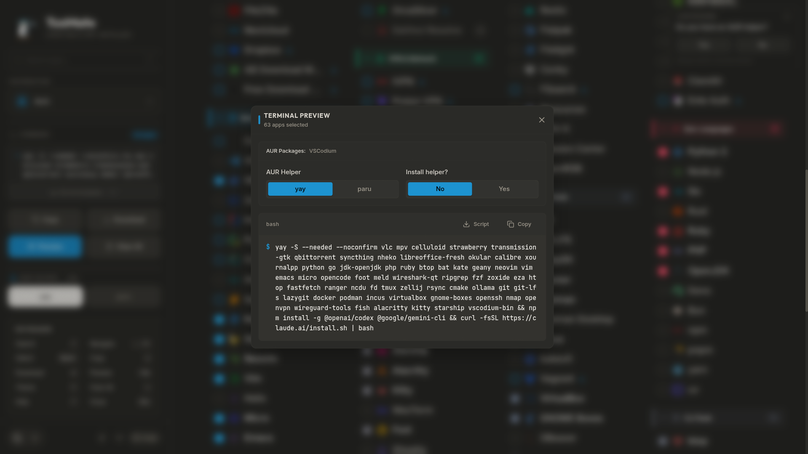
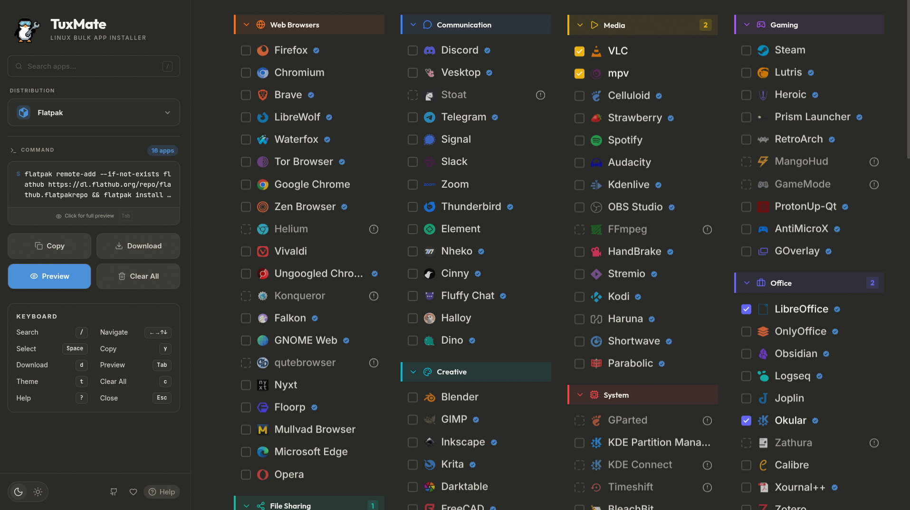

<!-- markdownlint-disable MD041 -->

<div align="center">
  <h1><a href="https://tuxmate.abusov.com/"></a></h1>


[](https://github.com/abusoww/tuxmate/issues)
[](https://github.com/abusoww/tuxmate/stargazers)
[](https://github.com/abusoww/tuxmate/blob/main/LICENSE)

</div>

<div align="center">
  <h2>🐧 The only Mate you need for setup</h2>
  <p><strong>TuxMate is a cross-distro install command generator built for real Linux workflows.</strong></p>
  <p>Choose apps once, generate inspectable commands/scripts for your distro, and run only what you understand.</p>
</div>

> [!NOTE]
> Package mappings are verified against official distro registries and reviewed under strict contribution rules. Repositories evolve over time, so some entries can become outdated or unavailable later. If you spot an issue, please report it so we can fix it quickly.

> [!WARNING]
> Security notice: TuxMate is a command generator (a wrapper around install logic), not a background installer. You copy and run commands yourself, so always inspect the generated command/script in the UI before executing. Downloadable scripts are produced with strict project rules, but no automation tool can replace user review. Confirm package names, flags, and targets for your distro before execution, and proceed at your own risk.


<div align="center">

## Supported Package Managers

[Ubuntu (apt)](https://packages.ubuntu.com/) · [Debian (apt)](https://packages.debian.org/) · [Arch (pacman)](https://archlinux.org/packages/) · [AUR](https://aur.archlinux.org/) · [Fedora (dnf)](https://packages.fedoraproject.org/) · [openSUSE (zypper)](https://software.opensuse.org/) · [Nix (nixpkgs)](https://search.nixos.org/packages) · [Flatpak (Flathub)](https://flathub.org/) · [Snap (Snapcraft)](https://snapcraft.io/) · [Homebrew](https://formulae.brew.sh/)

</div>

## Features

- Cross-distro generation: apt (Ubuntu/Debian), pacman + AUR helpers (yay/paru), dnf (Fedora), zypper (openSUSE), nix config output, Flatpak, Snap, and Homebrew.
- Native-first resolution with npm/script fallbacks only when a distro target is missing.
- Safe generation: inspectable output, installed-package checks, and retry with exponential backoff.
- Faster setup: parallel Flatpak installs.
- Homebrew-aware output with correct formula/cask separation.
- Clean terminal UX: colored logs, progress, ETA, and final summaries.
- Verification built in: AUR detection + allowlist, Nix unfree checks, and verified Flatpak/Snap badges.
- Productive UI: copy/download drawer, yay/paru switch, unfree warnings, and distro-aware context.
- Keyboard-first flow: Vim/arrow navigation, `/` search focus, and fast clear.
- PWA support with network-first service worker for resilient loading.


## Screenshots






<details>
<summary><h3>Development</h3></summary>

```bash
npm install
npm run dev
```

Open [http://localhost:3000](http://localhost:3000)

### Build

```bash
npm run build
npm start
```

</details>


<details>
<summary><h3>Project Structure</h3></summary>

- `src/app/`: App Router entrypoints, layout, globals, and error boundary.
- `src/components/`: UI modules (catalog, command drawer, distro selector, search, shared UI primitives).
- `src/hooks/`: App interaction hooks (state orchestration, keyboard navigation, theme, tooltips).
- `src/lib/apps/`: Source-of-truth app registry (category JSON files).
- `src/lib/scripts/`: Distro-specific script generators and shared shell helpers.
- `src/lib/generateInstallScript.ts`: Main orchestration for native targets + universal fallbacks.
- `src/lib/verification.ts`: Verified source badges (Flathub/Snap).
- `src/__tests__/`: Unit tests for data, script behavior, and utilities.

</details>


<details>
<summary><h3>Docker Deployment</h3></summary>

### Build and Run

```bash
docker build -t tuxmate:latest .
docker run -p 3000:3000 tuxmate:latest
```

### Use Prebuilt Image (GHCR)

```bash
docker pull ghcr.io/abusoww/tuxmate:latest
docker run -p 3000:3000 ghcr.io/abusoww/tuxmate:latest

# Version pinning example
docker pull ghcr.io/abusoww/tuxmate:v1.0.0
docker run -p 3000:3000 ghcr.io/abusoww/tuxmate:v1.0.0
```

### Docker Compose

```bash
docker-compose up -d
docker-compose logs -f
docker-compose down
```

Open [http://localhost:3000](http://localhost:3000)

### Port Mapping

```bash
docker run -p 8080:3000 tuxmate:latest
```

### Environment Variables

- `NODE_ENV=production` - Run in production mode
- `PORT=3000` - Application port
- `NEXT_TELEMETRY_DISABLED=1` - Disable Next.js anonymous telemetry

```bash
docker run -p 3000:3000 \
  -e PORT=3000 \
  -e NEXT_TELEMETRY_DISABLED=1 \
  tuxmate:latest
```

</details>


<details>
<summary><h3>Tech Stack</h3></summary>

- Core: [Next.js](https://nextjs.org/) 16 (App Router), [React](https://react.dev/) 19, [TypeScript](https://www.typescriptlang.org/)
- UI: [Tailwind CSS](https://tailwindcss.com/) 4, [Framer Motion](https://www.framer.com/motion/), [GSAP](https://gsap.com/), [Lucide React](https://lucide.dev/)
- Testing: [Vitest](https://vitest.dev/)

</details>

## 🤝 Contribution

See [CONTRIBUTING.md](CONTRIBUTING.md) for contribution guidelines.


## 🎯 Roadmap

### Completed
- [x] Multi-distro support (Ubuntu, Debian, Arch, Fedora, openSUSE)
- [x] Nix, Flatpak & Snap universal package support
- [x] 180+ applications across 15 categories
- [x] Smart script generation with error handling
- [x] Dark / Light theme toggle with smooth animations
- [x] Copy command & Download script
- [x] Custom domain
- [x] Docker support
- [x] CI/CD shortcuts & workflow
- [x] Search & filter applications (Real-time)
- [x] AUR Helper selection (yay/paru) + Auto-detection
- [x] Keyboard navigation (Vim keys, Arrows, Space, Esc, Enter)
- [x] Package availability indicators (including AUR badges)
- [x] Homebrew support (macOS + Linux)
- [x] PWA support for offline use
- [x] Nix configuration.nix download with unfree package detection


### Planned

- [ ] Winget support (Windows)
- [ ] Custom presets / profiles
- [ ] Share configurations via URL
- [ ] More distros (FreeBSD, Gentoo, Void, Alpine)
- [ ] i18n / Multi-language support
- [ ] Companion CLI tool
- [ ] Expand application catalog (200+)
- [ ] Dotfiles integration
- [ ] Declarative NixOS options support (programs.*) [Issue #36]


<details>
<summary><h4>Related Projects</h4></summary>
	
- **[LinuxToys](https://github.com/psygreg/linuxtoys)** – User-friendly collection of tools for Linux with an intuitive interface
- **[Nixite](https://github.com/aspizu/nixite)** – Generates bash scripts to install Linux software, inspired by Ninite
- **[tuxmate-cli](https://github.com/Gururagavendra/tuxmate-cli)** – CLI companion for tuxmate, uses tuxmate's package database

</details>


<details>
<summary><h4>Monetary Contributions</h4></summary>

No tips jar here. I’m happy just knowing you’re using Linux.

If you want to earn some real life karma points, consider donating to the following organizations:

* [KDE e.V.](https://kde.org/community/donations/)
* [Gnome Foundation](https://www.gnome.org/donate/)
* [Arch Linux](https://archlinux.org/donate/)
* [The Tor Project](https://donate.torproject.org/)

Comments, suggestions, bug reports and contributions are welcome.

</details>


<div align="right">

## 📜 License
Licensed under the [GPL-3.0 License](LICENSE) <br>
Free software — you can redistribute and modify it under the terms of the GNU General Public License.

<p align="center">
	
</p>
